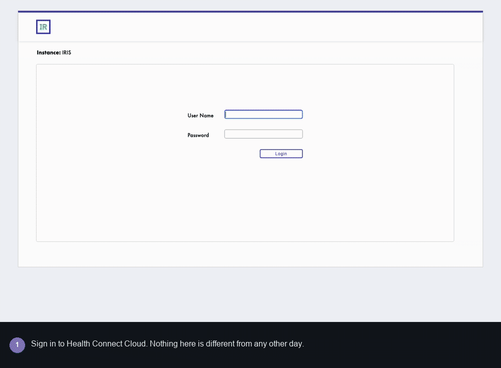
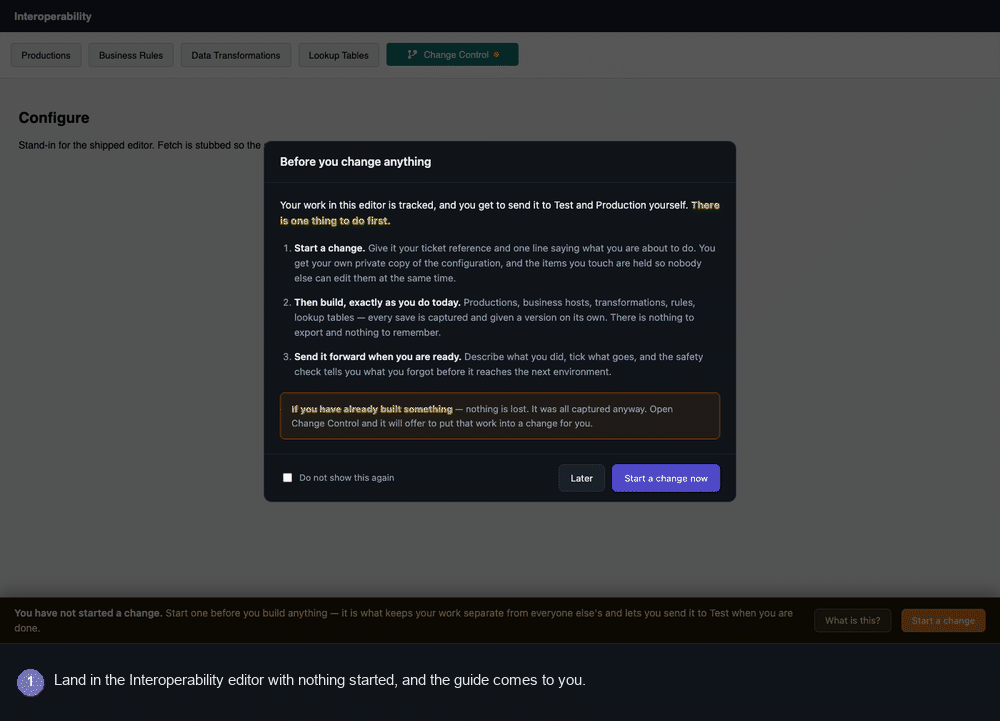
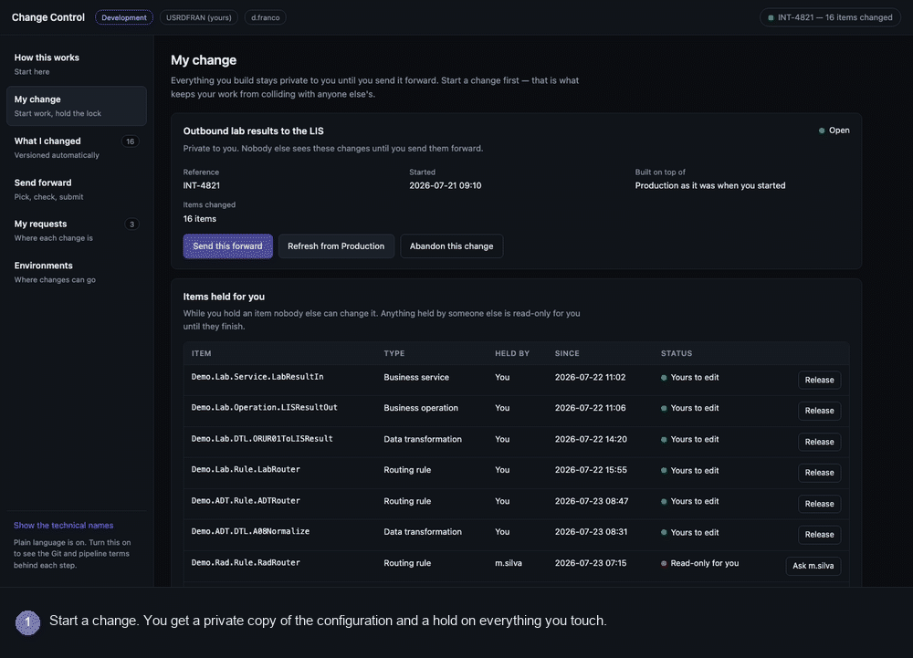
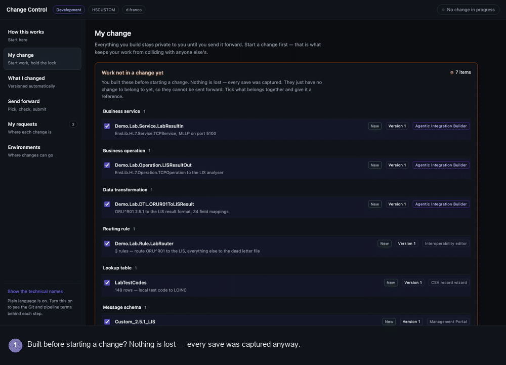

# Change Control for Health Connect Cloud

A change-promotion tool for the **Integration Builder** — the person who builds
and maintains interfaces in Health Connect Cloud, is accountable for them
working, and is not a developer.

They have no shell, no file-server access, no Git client and no appetite for
learning one. Today, moving what they built from Development to Test to
Production means asking someone else to do it, and finding out it was wrong
when it fails in the target environment. This tool closes that gap without
turning them into a developer.

This repository is a **working user-experience prototype**. Every screen,
interaction and rule behaves for real; the data behind it is a fixture rather
than a live IRIS query. The design is grounded in the documented InterSystems
Health Connect Cloud Embedded Git workflow, so the mock is a description of
something buildable, not a wish.

---

## Watch it — one run, start to finish

Sign in, start a change, create a production, put it under source control,
and move it to the next environment. Fifteen steps, one take, no cuts.



<sub>Plays automatically above. [Download the MP4](docs/img/production-journey.mp4) to pause and scrub.</sub>

| | |
|---|---|
| **1** | Sign in to Health Connect Cloud |
| **2–3** | Open Interoperability — the guide appears before anything is touched, and an amber strip says nothing is started |
| **4–5** | Start a change: one line saying what you are doing. The reference is generated — `HSCUSTOM-1`, the namespace and the next number |
| **6** | Back in the editor the strip is green. Go and build |
| **7** | Create an empty production — it appears on its own, version 1 |
| **8** | Add a business service — production moves to version 2 |
| **9–10** | Send it to Test. Tick the production, forget the service — the safety check blocks it |
| **11–12** | One click adds the service. Submit |
| **13** | Approval is bypassed on this instance, so it is signed off and deployed to Test at once — and labelled as such in its history |
| **14** | Send the same two items on to Production. They are not picked again |
| **15** | Where the next target is configured: the route, who approves at each stop, and whether approval can be bypassed |

**This is not a mock-up.** Between frames the recorder resets the baseline,
starts a change through the API, and creates a real production and a real
business service in the namespace. What the tool shows is that namespace read
back: version 1 on the empty production, version 2 once the service is wired in,
and a safety check that finds the dependency by parsing the production's own
`ProductionDefinition`. The change request, its approval and its promotion are
server-held too — the pipeline in frames 13 and 14 is real state, not a drawing.

The one concession: the capture API authenticates as a real user, and headless
Chrome has no way to obtain a session, so the recorder widens
`/api/hcccicd` for the duration and restores it in a `finally` block. That is
also why the header reads **Not signed in** in those frames.

Steps 9–11 are the reason the tool exists. The builder ticks the production and
forgets the business service — the single most common way a promotion fails. The
check sees `Demo.Generic.InboundService` referenced and not selected, and
refuses to submit until it is added. Without it the deployment reports success
and the production does not start in Test.

Two frames are staged, and both say so on screen. The sign-in frame is the real
login page captured but never submitted — the recorder does not type anyone's
password. The two editor frames use a stand-in page, because the shipped editor
is behind that login; everything Change Control draws on them is the real
`inject.js`.

<details>
<summary>Three shorter recordings — onboarding, the safety check in depth, and recovering unassigned work</summary>

<br>

**The editor tells you what to do before you touch anything.** The first session
is the one that goes wrong, so the instruction arrives unprompted.



**The safety check, on a bigger change.** Five items become eleven because six
dependencies would have been missed.



**Built something before starting a change?** Nothing is lost — but nothing was
holding those items either, so the tool checks whether a colleague edited the
same one.



These three run on seeded fixture data (`?demo=`), so they show a populated
change with a colleague holding items. Only the run above is against real IRIS.

</details>

---

## Diagrams

**[User journey](docs/DIAGRAMS.md#1-user-journey)** — what the Integration
Builder actually does, from signing in to the change running in Production,
including the recovery branch and what happens when the safety check fires.

**[Architecture and APIs](docs/DIAGRAMS.md#2-architecture-and-apis)** — where
each piece runs, the REST surface, the per-user state in `^HCCCICD`, and which
parts are real today versus still fixtures.

---

## The problem it solves

Two things go wrong when a non-developer promotes a change.

**They collide with each other.** Two people editing the same routing rule in
the same namespace, and the second save silently wins.

**They send an incomplete set.** They tick the production but not the business
host it points at. The deployment succeeds, the production will not start, and
nobody finds out until Test is broken. This is the classic failure mode of
Salesforce change sets, and the reason tools like Gearset exist — dependency
detection that is proactive rather than a button you have to remember to press.

The tool answers both: an explicit workspace with item-level locks, and a
safety check that walks the dependency graph before anything moves.

---

## What it does

| Screen | What the user does |
|---|---|
| **How this works** | The six-step walkthrough, a FAQ, and a plain-language ↔ Git glossary. Also shown as a dismissible welcome the first time the tool is opened. |
| **My change** | Starts a piece of work under a ticket reference. Gets a private workspace and holds the items they touch. Sees what other people are holding — and, if they built something before starting a change, adopts that work into one. |
| **What I changed** | Reviews everything that was captured and versioned automatically — no export step, whatever tool made the change. |
| **Send forward** | A four-step wizard: describe it, pick the items, run the safety check, submit. |
| **My requests** | Where each submitted change is in the Development → Test → Production pipeline, and the button to send it on. |
| **Environments** | The promotion path, who approves at each stop, and which kinds of artifact are handled differently on the way over. |

### Vocabulary

The main flow contains no Git words at all. "Branch" is *your change*, "commit"
is *saved automatically*, "merge request" is *change request*, "pipeline" is
*deployment*. A **Show the technical names** toggle in the left rail reveals
branch names, user namespaces and deployment identifiers for anyone who wants
them, and every card carries a collapsible "what this does behind the scenes"
note. Nothing is hidden — it is just not in the way.

---

## The process end to end

What actually happens, from opening the Health Connect Cloud Interoperability
page to the change running in Production. This is also built into the tool
itself, under **How this works**, and shown as a welcome the first time it is
opened.

**1 — Start a change.** In the Interoperability page, click **Change Control**
in the toolbar, go to **My change**, enter a ticket reference and one line
describing the work, and press **Start working**.

This is the only step the user has to remember. It cuts a feature branch from
`live` into their own user namespace and begins registering edit claims for
whatever they touch.

**2 — Go and build, unchanged.** Interoperability editor, Management Portal,
CSV record wizard, rule editor, transformation builder, or the Agentic
Integration Builder. Nothing about how they work changes.

Every save is exported and versioned on its own — no export step, no "add to
source control" button. A new namespace, production, transformation or lookup
table is captured as version 1 the moment it exists.

**3 — Check what was captured.** **What I changed** lists everything, grouped
by kind, with version, timestamp and which tool made it. Changes the agent made
on the user's behalf are tagged as such.

**4 — Send it forward.** Describe it and why (mandatory — the approver reads
it), tick the items, run the safety check, submit. Blocking findings prevent
submission; warnings are acknowledged individually.

**5 — Track it, then send it on.** **My requests** shows each change's position
in the pipeline. Test where it landed, then press *Send on to …* — the same
items go forward without re-picking, and the safety check re-runs against the
new target.

### If they built before starting a change

The common first-time case, and it is recoverable. Capture never depended on
step 1: Embedded Git exports on save regardless of which branch is checked out,
so the work is sitting in the working tree. What is missing is the label saying
which piece of work it belongs to, and the edit claim.

**My change** detects it and shows **Work not in a change yet**. The user ticks
what belongs together, gives it a reference and a description, and presses
**Put this into a change**. The branch is created now and the uncommitted
changes carry onto it; claims are registered retroactively. From that point it
behaves exactly as if step 1 had happened first, and it can be sent forward
normally. Unticked items stay behind, so two unrelated pieces of work can be
split into two changes.

There is one real cost, and the tool states it plainly rather than hiding it:
while the work was unassigned, nothing was holding those items, so somebody else
may have edited the same artifact. **Check nobody else touched these** compares
each item against the base branch and names who changed what and when. Adoption
is still allowed — the work is not lost either way — but never silently: an
unchecked collision forces a confirmation before anything proceeds.

---

## The safety check

This is the part worth looking at. Given the selected items and a target
environment, it walks every reference out of every selected item, transitively,
and classifies what it finds.

**Blocking — the deployment would break**

- *Missing.* The item is in your workspace, you did not tick it, and the target
  has never had it. One click adds it, and the check re-runs and follows the
  newly added item's own references. In the seeded demo, resolving the chain
  takes a 5-item selection to 12.
- *Absent.* Nothing in your workspace and nothing in the target provides it.
  You cannot fix this yourself, so the tool explains who can.

**Warning — needs a human decision, does not block**

- *Secrets.* Credentials and OAuth clients travel as an empty shell. The
  password never leaves the environment it was typed into.
- *Per-environment settings.* System Default Settings hold host names, ports and
  directories that differ per environment. The tool shows a side-by-side of your
  values against the target's and flags every setting with no target value.
- *Data.* Globals overwrite whatever is in the target. Explicit confirmation.
- *Platform objects.* A namespace cannot be created by a deployment pipeline; it
  becomes a platform request raised alongside the change.
- *Downgrade.* You are shipping a caller built against a newer version of
  something you did not tick.

**Information** — e.g. the change edits interfaces currently carrying traffic,
which is why Production needs a window.

Blocking findings disable the submit button. Warnings must each be
acknowledged, and anything left unacknowledged is attached to the request for
the approver to see.

### Dependencies it knows about

Production → business hosts · business host → adapter, message class, schema
category, credential, per-host settings · routing rule → transforms it calls,
targets it sends to, lookup tables it reads · DTL → source and target classes,
lookup tables · BPL → called hosts, context classes, transforms · record map →
generated classes.

In a real implementation these come from reading the production definition
XData, the rule definition, the DTL source and the host settings — not from a
hand-maintained list.

---

## Install

Requires a running IRIS for Health or Health Connect container with the
Interoperability editor present.

```bash
./scripts/deploy.sh <container> <namespace>
```

Defaults are `iris-agentic` and `HSCUSTOM`. The script copies the static UI to
`/usr/irissys/csp/hcccicd/`, compiles the installer, and runs it.

The installer, `HCCCICD.Install.Setup`, is idempotent and additive:

```objectscript
do ##class(HCCCICD.Install.Setup).Apply()    // web app + editor tab
do ##class(HCCCICD.Install.Setup).Status()   // what is installed
do ##class(HCCCICD.Install.Setup).Revert()   // put everything back
```

It creates the `/hcccicd` static application, the `/api/hcccicd` REST
application for live capture, and appends one script tag to the shipped editor
page, backing the original up first. It shares no identifier, style or file
with any other application on the instance, so it can be removed without
disturbing anything else.

### Open it

- Standalone: `http://<host>:<port>/hcccicd/index.html`
- In context: open the Interoperability editor and click **Change Control** in
  the dashboard strip.

Three modes:

- **default** — a change is already open with 16 captured items. The better
  demo of the safety check.
- **`?fresh=1`** — no change open, and seven items already captured without
  one. The recovery scenario, and what most builders will actually hit the
  first time.
- **`?live=1`** — no fixtures. The workspace, the change list and the
  unassigned work all come from the real namespace. See below.

---

## Live mode — drive it against a real namespace

`/hcccicd/index.html?live=1` reads the namespace instead of a fixture. Create a
production in the Interoperability editor and it appears in the tool.

No sign-in step. `/api/hcccicd` allows unauthenticated callers, because neither
the Management Portal (session cookie scoped to `/csp/sys/`) nor the
Interoperability editor (its own bearer token) can hand a third web application
a CSP session — password-only authentication meant a 401 on every request no
matter how many times you signed in.

When a session does identify you, `$username` is used and your baseline follows
your name. When it does not, the header shows **Not signed in** and the work is
tracked under a shared `UnknownUser` bucket. Fine for one instance; a real
deployment would validate the editor's bearer token instead. See
[Authentication](docs/DIAGRAMS.md#authentication--why-the-api-allows-unauthenticated-callers).

Two header controls appear in this mode:

- **Start from zero** — declares the namespace as it stands to be the baseline.
  The change list goes empty. Nothing is deleted; it only moves the line that
  says what counts as new. This is how you begin a clean test.
- **Refresh** — re-reads the namespace. Anything you built since the last read
  shows up.

### Walk the test

1. Open the tool with `?live=1`, press **Start from zero**. Zero changes.
2. Go to **My change**, enter a reference and a description, **Start working**.
3. In the Interoperability editor, create a production — the name alone is
   enough.
4. Back in the tool, press **Refresh**. The production is there: *new*, version
   1, "Empty production, no items yet".
5. Add a business host to it and refresh again. Version 2, the detail becomes
   "1 items", and the safety check now knows the production depends on that
   host — it reads the reference straight out of the production definition.
6. Do step 3 *before* step 2 and it lands under **Work not in a change yet**
   instead, which is the recovery path.

### What is real and what is not

Real: the workspace, the change list, versions, artifact types, deletions,
unassigned-work detection and adoption, and the dependency edges — those are
read from the production definition, the rule definition and the transform.

Still mocked: the target environments and their baselines, the promotion path,
approvals and the request history. There is one environment on a single
instance, so there is nothing to read.

Capture is polling class metadata and comparing timestamps, which is a stand-in
for Embedded Git intercepting the save event. One consequence is visible: it
cannot tell which editor made the change, so everything reads "Captured from
IRIS" rather than naming the tool. Embedded Git can, which is why the fixture
shows real tool names.

Backed by `HCCCICD.REST.Dispatch` at `/api/hcccicd`:

```
GET    /whoami
GET    /state          the open change, the change list, unassigned work
POST   /workspace      start a change      { ref, title, base }
DELETE /workspace      abandon it
POST   /adopt          adopt unassigned work { ref, title, items[] }
POST   /reset          set the baseline to now
```

State lives in `^HCCCICD`, keyed by user, so two people on the same instance do
not see each other's baseline.

---

## Where the mock ends

Everything goes through the `DATA` block at the top of
[`change.js`](src/csp/hcccicd/change.js). Each function names the IRIS or
Embedded Git call that would back it. Nothing below that block knows the data is
fixed.

The one live call is `/api/agentic/whoami`, so the header shows the real
signed-in user and namespace when the tool is opened from an authenticated
session.

To make it real, the work is: read the working-tree diff for the user's branch
and decorate it with artifact type; compute `requires` from the IRIS metadata
rather than the fixture; replace the baseline with the target branch's file list
and the pipeline's deployment record; and raise a real merge request on submit.
The user interface does not change.

---

## Documentation

- [Diagrams](docs/DIAGRAMS.md) — the user journey, and the architecture with its
  REST surface.
- [Design notes](docs/CHANGE_CONTROL.md) — persona, the workflow it models, the
  dependency rules in full, and how each screen maps to Embedded Git and the
  Health Connect Cloud pipeline.
- [Demo script](docs/DEMO_SCRIPT.md) — a walkthrough that lands the two points
  the tool exists to make.

## Recording the walkthroughs

```bash
HCCCICD_USER=_SYSTEM HCCCICD_PASSWORD=... ./scripts/record-production-journey.py
./scripts/record-walkthrough.py    # the three fixture recordings
./scripts/gif-to-mp4.py            # MP4 alongside every GIF
```

The journey recorder needs credentials because the capture API authenticates as
a real user. It passes them through `scripts/harness/record.html`, a full-bleed
iframe that answers the same `hcccicd:need-auth` handshake the Interoperability
editor does — so the tool authenticates exactly as it would in production.
Nothing is stored; the credential comes from the environment.

The first drives the tool through its `?demo=` deep links with headless Chrome,
captures a full-resolution frame per state, adds a caption bar and assembles the
GIFs. Edit the `WALKTHROUGH`, `RECOVERY` and `ONBOARDING` tables at the top of
the script to change the sequence, timings or captions. The editor-onboarding
frames run against `scripts/harness/editor.html`, a stand-in for the shipped
editor with the state stubbed, because the real one needs a login.

The second re-times those same GIFs into H.264 MP4s via AVFoundation
(`scripts/mp4encode.swift`). The GIFs stay the source of truth, so the two
cannot drift apart. Neither script needs ffmpeg or a browser-automation
library — Chrome's `--screenshot`, Pillow and the `swift` that ships with macOS
are enough.

### Why the GIF and not a video player

GitHub strips `<video>` elements from README markdown, and
`raw.githubusercontent.com` serves MP4 as `application/octet-stream` with
`nosniff`, so a self-hosted video will not play inline no matter how it is
referenced. An animated GIF is the only thing that genuinely embeds and
autoplays, which is why it leads each section.

The one supported route to a real player is GitHub's own attachment CDN: drag
an MP4 into the comment box of an issue or pull request in the browser, and
GitHub mints a `user-attachments` URL that its markdown pipeline turns into a
player. That URL can then be pasted into the README. It requires the web UI —
there is no API for it — so the MP4s are committed here for anyone who wants to
do that, or simply to pause and scrub through a 40-second walkthrough.

## References

- [Embedded Git for InterSystems](https://github.com/intersystems/git-source-control)
- [Health Connect Cloud workflow](https://github.com/intersystems/git-source-control/blob/main/docs/hcc.md)
- [Introducing InterSystems Health Connect Cloud](https://docs.intersystems.com/services/csp/docbook/DocBook.UI.Page.cls?KEY=HCC_intro)
