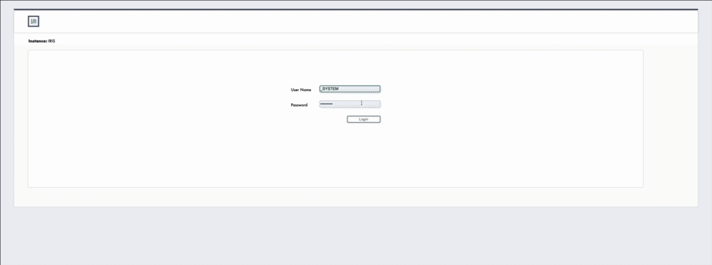

# Change Control for Health Connect Cloud

Source control and environment promotion for the **Integration Builder** — the
person who builds and maintains interfaces, is accountable for them working, and
is not a developer.

No shell. No file server. No Git client. They build interfaces in the
Interoperability editor, and today they cannot move their own work to Test
without asking someone else — then find out it was wrong when it fails there.

This adds one button to the editor they already use.



<sub>[Full recording (MP4, 3½ minutes)](docs/img/change-control-demo.mp4) — start
a change, build a production, run the safety check, approve it, promote it.</sub>

---

## Install

Requires InterSystems IRIS for Health or Health Connect 2023.1 or later.

**With IPM**

```
zpm "load https://github.com/dfrancoisc/HCCCICD.git"
```

Verified with IPM 0.10.8 on IRIS for Health 2026.3 (`zpm "load <folder>"` from a clone), September 2026. Earlier versions of `module.xml` were rejected by IPM (SystemRequirements text form, `${root}` in the static bundle path); use the deploy script only if you are on such a version.

**Without IPM** — clone, then run the deploy script against a running container:

```
./scripts/deploy.sh iris-agentic HSCUSTOM
```

Both routes do the same three things: compile `HCCCICD.*`, create the `/hcccicd`
and `/api/hcccicd` web applications, and append one `<script>` tag to the shipped
Interoperability editor page — backing it up first.

Then open **Interoperability** and look for the **Change Control** icon (a branch
symbol with a status dot) at the right end of the editor's toolbar strip. Hover
it for what it does and whether a change is open.

To remove it: `zpm "uninstall hcccicd"`, or
`do ##class(HCCCICD.Install.Setup).Revert(1)`. The editor page is restored from
its backup, and nothing you captured is deleted.

---

## What it does

**It tells you what to do before you touch anything.** Land in the editor with
nothing started and a short guide appears, unprompted. A strip along the bottom
stays amber until you start a change, and turns green once you have.

**It captures everything, on its own.** Every save is recorded and given a
version number — productions, business hosts, transformations, business
processes, routing rules, lookup tables, adapters. No export step and no "add to
source control" button, whichever editor you used. A new artifact is version 1
the moment it exists; a deletion is recorded as a deletion.

**It stops you sending an incomplete change.** This is the reason the tool
exists. Tick a production but forget the business service it points at and the
deployment succeeds, the production does not start, and nobody finds out until
Test is broken. The safety check reads the production's own definition, follows
every reference, compares it with the target environment, and refuses to submit
until the gap is closed. One click adds the missing item and it re-runs.

**It holds what you are working on.** The items you touch are claimed, so two
builders cannot silently overwrite each other. If you built something *before*
starting a change, nothing is lost — the tool offers to adopt that work, and
tells you that nobody was holding it in the meantime.

**It carries the change through environments.** Development → Test → Production,
with per-environment approvers. Approve it, watch it land, then send the same
items on without picking them again.

---

## Configuration

All of this is set inside the tool, under **Environments**.

| | |
|---|---|
| **Promotion path** | Which environment each one sends to, its namespace, and who approves there. Per namespace. Cycles are refused. |
| **Change references** | *Numbered by the system* (default) gives `HSCUSTOM-1`, `HSCUSTOM-2`, … — the namespace and the next number, nothing to type. *Entered by the builder* takes your own ServiceNow or Jira reference; left blank, one is generated anyway. |
| **Approval** | *Required* — the change waits for the approver configured for the target environment. *Bypassed* — submitting approves and deploys in one step, for showing the pipeline where there is nobody else to approve. |

---

## Does it work alongside the Agentic Integration Builder?

Yes. Both are installed on the instance together and share the Interoperability
editor page. Checked rather than assumed:

- Both launchers are loaded by the editor and share no state. The one thing
  they deliberately share is the toolbar group (`isc-editor-tools`, buttons
  `isc-tool-btn`, tooltip `#isc-tool-tip`): whichever script loads first builds
  it, the other adds its icon to it, and either can be removed on its own
- Four separate web applications, no path collision: `/agentic`, `/api/agentic`,
  `/hcccicd`, `/api/hcccicd`
- Both APIs answer `200` with the other installed
- State lives in `^HCCCICD` only; nothing belonging to the other application is
  written
- Its **Clean up namespace** (bin) icon still works with this loaded

With both installed, the toolbar group shows three icons side by side: AI
Settings, Change Control and the bin. (The recording at the top predates the
icon toolbar and shows the older text tabs.)

One thing worth knowing. The bin skips anything named `AgenticInterop.*` — that
guard stops it deleting its own code, so test artifacts named under that prefix
are invisible to it. Name them something else.

---

## Vocabulary

The main flow contains no Git words. "Branch" is *your change*, "commit" is
*saved automatically*, "merge request" is *change request*, "pipeline" is
*deployment*. A **Show the technical names** toggle in the left rail reveals
branch names, user namespaces and deployment identifiers, and every card carries
a collapsible "what this does behind the scenes" note. Nothing is hidden — it is
just not in the way.

---

## How much of this is real

| Real today | Still a fixture |
|---|---|
| Capture, versioning, deletions | Deploying into a second environment |
| Held items and adoption | Rejection and reopen |
| Dependency graph, read from the artifacts themselves | Cross-environment settings comparison |
| Change requests, approval, promotion | The Test and Production baselines |
| Environment and approval configuration | |

Capture polls class metadata and compares timestamps. Embedded Git intercepts the
save event and writes a file — that is the real mechanism, and the REST shape
here is the one it would serve. The visible consequence is that this cannot tell
which editor made a change, so everything reads "Captured from IRIS".

There is one instance and one namespace, so Test and Production are described
rather than deployed into.

---

## Documentation

- **[Product requirements (PRD.docx)](docs/PRD.docx)** — the outcome-driven PRD
  for the non-developer Integration Builder: the problem, the persona, the
  six-step user journey (session reference → private workspace → build →
  pick what travels → safety check → promote) with its workflow diagram,
  prioritized user stories, risks, and success metrics
- **[Build specification](docs/SPECIFICATION.md)** — the handover document for a
  development team building the real tool: persona, user stories, numbered
  requirements, integration architecture, and an honest account of what the
  prototype settled and what it did not
- [Design and behaviour](docs/CHANGE_CONTROL.md) — every screen, the dependency
  rules, the promotion rules, and the live capture layer
- [Diagrams](docs/DIAGRAMS.md) — user journey, architecture, and the REST surface
- [Demo script](docs/DEMO_SCRIPT.md) — what to show, in what order

---

## API

All under `/api/hcccicd`, authenticated with the Interoperability editor's own
JSON Web Token.

```
GET    /whoami
GET    /state                     open change, change list, unassigned work
POST   /workspace                 start a change        { title, ref?, base? }
DELETE /workspace                 abandon it
POST   /adopt                     adopt unassigned work { ref?, title, items[] }
POST   /reset                     set the baseline to now
GET    /config                    reference mode, next reference, approval mode
PUT    /config                    { idMode?, approvalRequired? }
GET    /environments              the promotion path
PUT    /environments/:id          { name?, namespace?, next?, approval?, approvers? }
GET    /requests                  change requests
POST   /requests                  submit the open change
POST   /requests/:id/approve      approve and deploy
POST   /requests/:id/promote      send on to the next environment
```

`X-IRIS-Namespace` selects the namespace, so the tool reads whichever one you
have open in the editor.
