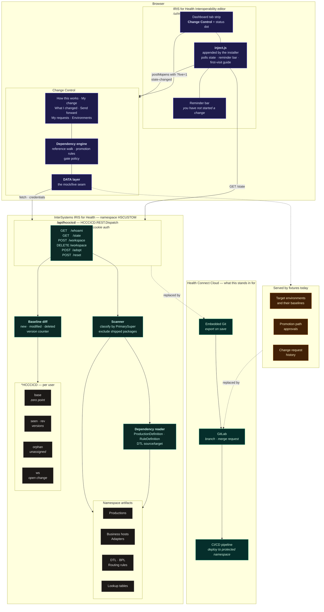

# Diagrams

Both render natively on GitHub. Source is Mermaid, so they stay in version
control and diff like text.

---

## 1. User journey

What the Integration Builder actually does, from signing in to the change
running in Production — including the branch for work built before a change was
started, and what happens when the safety check finds something.

```mermaid
flowchart TD
    A["Sign in to Health Connect Cloud<br/>Open the Interoperability editor"] --> B{"Change Control:<br/>is a change open?"}

    B -->|"No — amber dot"| C["Guide appears:<br/><b>Before you change anything</b><br/>plus a persistent reminder bar"]
    B -->|"Yes — green dot"| G

    C --> D{"Have you already<br/>built something?"}

    D -->|"No"| E["<b>Start a change</b><br/>ticket reference + one line"]
    D -->|"Yes"| R1

    E --> F["Private copy of the configuration<br/>Edit claims held on what you touch"]
    F --> G

    G["<b>Build as you always do</b><br/>Interop editor · Management Portal<br/>CSV wizard · Agentic Integration Builder"]
    G --> H["Every save captured and versioned<br/>automatically — no export step"]
    H --> I{"Ready to<br/>send forward?"}
    I -->|"Not yet"| G

    I -->|"Yes"| J["<b>1. Describe it</b><br/>what changed, why, risk, rollback"]
    J --> K["<b>2. Pick the items</b>"]
    K --> L["<b>3. Safety check</b><br/>walk every reference, compare<br/>with the target environment"]

    L --> M{"Findings?"}
    M -->|"Blocking —<br/>missing dependency"| N["One click adds it<br/>check re-runs transitively"]
    N --> L
    M -->|"Blocking —<br/>absent everywhere"| O["Tool explains who can<br/>create it in the target"]
    O --> L
    M -->|"Warning —<br/>secret, per-env, data"| P["Acknowledge each one<br/>individually"]
    P --> Q
    M -->|"None"| Q

    Q["<b>4. Review and submit</b>"] --> S["Change request raised"]
    S --> T{"Approval needed<br/>in the target?"}
    T -->|"Development — none"| U
    T -->|"Test — one person"| V{"Approved?"}
    T -->|"Production — two<br/>plus a change window"| V

    V -->|"Yes"| U["CI/CD deploys into<br/>the protected namespace"]
    V -->|"Sent back<br/>with a reason"| W["Reopen in your workspace<br/>fix, send again"]
    W --> G

    U --> X["Test it where it landed"]
    X --> Y{"Another<br/>environment?"}
    Y -->|"Yes"| Z["<b>Send on</b> — same items,<br/>no re-picking, check re-runs<br/>against the new target"]
    Z --> T
    Y -->|"No — live in Production"| AA["Workspace closes<br/>claims released"]

    R1["<b>Work not in a change yet</b><br/>appears on My change"] --> R2["Check nobody else<br/>touched these"]
    R2 --> R3{"Collision?"}
    R3 -->|"Yes"| R4["Named: who changed what,<br/>when. Confirm before continuing"]
    R3 -->|"No"| R5
    R4 --> R5["<b>Put this into a change</b><br/>branch created now, claims<br/>registered retroactively"]
    R5 --> G

    classDef start fill:#1e293b,stroke:#475569,color:#e2e8f0
    classDef action fill:#312e81,stroke:#4f46e5,color:#e0e7ff
    classDef check fill:#134e4a,stroke:#0d9488,color:#ccfbf1
    classDef problem fill:#7f1d1d,stroke:#dc2626,color:#fee2e2
    classDef warn fill:#78350f,stroke:#d97706,color:#fef3c7
    classDef done fill:#064e3b,stroke:#10b981,color:#d1fae5

    class A,B start
    class E,F,G,H,J,K,Q,S,Z action
    class L,M,V,T,I,D,Y,R2,R3 check
    class N,O,R4 problem
    class C,P,W,R1,R5 warn
    class U,X,AA done
```

---

## 2. Architecture and APIs

Where each piece runs, what talks to what, and which parts are real today
versus still fixtures.

### Request flow, in words

1. The installer appends one `<script>` to the shipped editor page. `inject.js`
   adds the **Change Control** tab and immediately calls `GET /state`.
2. If no change is open, the first-visit guide appears and a reminder bar stays
   pinned to the bottom of the editor until one is started. The tab's status dot
   is amber; green once a change is open.
3. Opening the tool loads `/hcccicd/index.html?live=1` in a full-screen iframe.
   Everything it renders goes through the `DATA` layer.
4. `GET /state` scans the namespace, classifies each artifact by its superclass
   chain, diffs it against the per-user baseline in `^HCCCICD`, and returns the
   open change, the change list, and any unassigned work — with dependency edges
   read out of each artifact.
5. Starting, adopting or abandoning a change writes to `^HCCCICD` and the tool
   posts `hcccicd:state-changed` to the editor, so the bar and dot update
   without waiting for the 20-second poll.
6. The safety check runs entirely in the browser over the returned graph. The
   target-environment baseline it compares against is still a fixture.

### Authentication

`/api/hcccicd` authenticates as the calling user, because it reads their
namespace. `UseCookies=1` with `CookiePath=/` lets an existing Management Portal
or Interoperability editor session through; the dispatch class keeps
`UseSession=0`, so the session identifies the caller and never holds request
state — that combination is what avoids the deadlock when the page is fetched
from an iframe with credentials. A 401 becomes a specific instruction in the UI,
since standalone in a fresh tab it is the expected first response.
